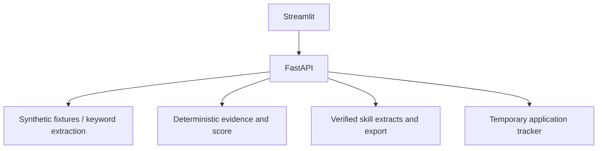

# HireMe AI
**Discover. Match. Tailor. Verify.**

[Open HireMe AI](https://hireme-ai-tau.vercel.app) ·
[Legacy Streamlit fallback](https://hirem-ai.onrender.com) ·
[CI checks](https://github.com/JatinSharmab/hirem-ai/actions) ·
[Deployment and operations](docs/PUBLIC_DEPLOYMENT.md)

## Next.js migration

The new interface is in `frontend/`: Next.js, TypeScript, React and Tailwind,
with a private server-side BFF to the existing FastAPI backend. Local production
build and live-backend acceptance pass. The public Next.js website is hosted on
Vercel Hobby, with FastAPI on Render Free and the existing Supabase database.
See the [deployed-site guide](docs/VERCEL_RELEASE.md) for URLs, checks and updates.

- [Run locally and deploy to Vercel](docs/NEXTJS_MIGRATION.md)
- [Feature/API migration matrix](docs/MIGRATION_MATRIX.md)
- [Validation and remaining release gates](docs/FRONTEND_VALIDATION.md)
- [Simple-language interview guide](docs/FRONTEND_INTERVIEW_GUIDE.md)

## Existing Streamlit portfolio release (fallback)

The site supports anonymous workspaces without signup, bounded live AI usage and
responsive layouts. Follow [the deployment guide](docs/PUBLIC_DEPLOYMENT.md) for
local review, device checks and Render + Supabase setup. Hosted Gemini and database
acceptance checks pass. Visual phone/iPad checks remain outstanding. Free hosting
may need time to wake up after inactivity.

The older [static homepage](https://hirem-ai-portfolio.onrender.com) remains available
for the fallback. Share the Vercel link above for the new interface. Its page shells
load independently of Render; data and AI actions can still wait for the backend
to wake. No always-on ping service or paid compute upgrade is configured.

## Start here: real Gemini / local live mode

The latest version connects Gemini to resume extraction, real JD analysis and selection
of relevant reviewed facts for verified resume extracts. Real jobs and analyzed
requirements are stored in PostgreSQL. Your local .env is configured for live mode.

Follow [the complete local live guide](docs/LOCAL_LIVE_GUIDE.md) for key setup,
independent start/stop commands, troubleshooting and completion milestones.
Open Privacy & session, then Local configuration, to test your key locally.

The older demo instructions below describe APP_MODE=demo; live mode disables synthetic
profiles and job fixtures. Profiles remain in temporary sessions; jobs and applications
now use isolated PostgreSQL workspaces with expiry. The full master prompt remains incomplete.


HireMe AI is a local career-tool demonstration and a foundation for the larger
Agentic Career Intelligence project. It does **not yet implement the full master prompt**.
The original prompt used Aptivara; this repository keeps your chosen name, HireMe AI.

Read [the audit and next steps](docs/VALIDATION_AND_NEXT_STEPS.md) before deployment.
The current architecture document describes the connected workflow and explicitly
separates graph/vector scaffolding from live functionality.

## Run locally on this Windows machine

Python 3.12, a virtual environment and dependencies were installed in the project
during the review. No Gemini key or database is required for the synthetic demo.

Open two PowerShell terminals in this folder.

Terminal 1:
```powershell
cd C:\Users\USER\OneDrive\Desktop\hireme-ai
.\.venv\Scripts\python.exe -m uvicorn apps.api.main:app --host 127.0.0.1 --port 8000
```

Terminal 2:
```powershell
cd C:\Users\USER\OneDrive\Desktop\hireme-ai
.\.venv\Scripts\python.exe -m streamlit run apps/ui/Home.py --server.address 127.0.0.1 --server.port 8501 --server.headless true
```

Open http://localhost:8501. API documentation is at http://localhost:8000/docs.
If a port is already in use, the review's server may still be running; open the URL first.
For terminals you started yourself, Ctrl+C stops that server.

Alternatively use `powershell -ExecutionPolicy Bypass -File scripts/start-local.ps1 api`
and the same command with `ui`.

## Demo walkthrough

1. Candidate Profile → Try Demo Candidate. The fictional facts are pre-reviewed.
2. Job Discovery → browse synthetic jobs. Clear the query to see every fixture.
3. Job Match → choose a job → Calculate Career Fit Score.
4. Resume Studio → Create verified skill extract → review → approve download.
   PDF and DOCX contain conservative skill statements, not a complete tailored CV.
5. Applications → Track job → choose and save a manually recorded status.
6. Market Insights → inspect skill counts from the synthetic corpus.

Uploaded resumes use keyword extraction. Review and confirm facts before using them.
Names/experience are not intelligently extracted. No paid AI calls occur in this flow.
Candidate and resume history last the browser session; application records last the API
process and are shared. Use one local user, not public real-candidate data.

## What is connected



Separately implemented foundations include SQLAlchemy models, Alembic migrations,
LangGraph definitions, Gemini provider adapters and direct ATS adapters.
These are not a completed persistent/live agent workflow.

## Fresh-machine setup

Install uv and Python 3.12 (uv can install Python), then:
```powershell
uv sync --locked --extra dev
Copy-Item .env.example .env
```
Copy the example only if you do not already have a .env file.
Pip fallback: `python -m venv .venv`, then
`.venv\Scripts\python.exe -m pip install -e ".[dev]"`.
The uv workflow uses the committed lockfile; pip's fallback resolves current versions.

## Validation

```powershell
powershell -ExecutionPolicy Bypass -File scripts/start-local.ps1 check
```

This runs Ruff, formatting, mypy, pytest and the offline golden evaluation.
See [VALIDATION_REPORT.md](VALIDATION_REPORT.md) for results and limits.
Tests do not consume paid APIs.

## PostgreSQL: separate next step

Install/start Docker Desktop, then:
```powershell
docker compose up -d postgres
docker compose ps
.\.venv\Scripts\python.exe -m alembic upgrade head
.\.venv\Scripts\python.exe -m alembic check
```

The default DATABASE_URL matches Compose. /ready returns 503 without a reachable database;
the fixture-based demo still works. Migrations create schema, not service integration.
`scripts/seed_demo.py` checks fixtures only; it does not insert database records.
Downgrading the initial migration deletes all application tables.

## Configuration and deployment

.env.example documents backend settings. Demo mode requires no credentials.
The UI reads API_BASE_URL from its environment, defaulting to http://127.0.0.1:8000.
Use a documented Gemini model accessible to your account when live integration is built.
Changing ENABLE_LIVE_JOB_DISCOVERY alone currently does not connect live discovery.

[Deployment guide](docs/DEPLOYMENT.md) covers GitHub → Supabase → Render → Streamlit.
Complete the audit's deployment blockers first. No deployment was performed.

## Learning order

1. [Audit and next steps](docs/VALIDATION_AND_NEXT_STEPS.md)
2. [Architecture](docs/ARCHITECTURE.md), read as target design
3. [Matching](docs/MATCHING_ENGINE.md), noting current proxy score components
4. [Resume grounding](docs/RESUME_GROUNDING.md), noting exact-excerpt restrictions
5. [Tests](tests/) and [evaluation](evaluation/run_evaluation.py)
6. [Production scaling](docs/PRODUCTION_SCALING.md)
7. [Interview guide](docs/INTERVIEW_GUIDE.md), qualify unfinished features honestly

MIT licensed.
