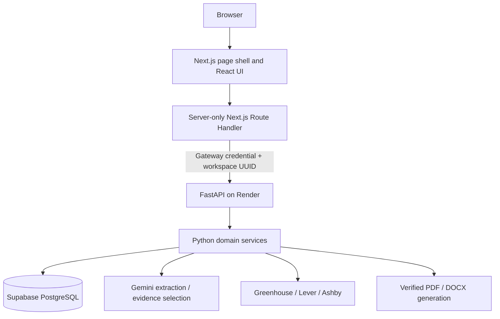

# HireMe AI architecture — implemented workflow

The engineering story is **evidence-grounded career intelligence**: AI extracts and selects; humans review; Python validates, scores and verifies; the frontend explains the results.

## Interface migration

The repository includes `frontend/`, a Next.js/React/TypeScript/Tailwind application prepared for Vercel. Streamlit on Render remains the public fallback until the new hosted release is validated. See [deployment instructions](NEXTJS_MIGRATION.md), [feature parity](MIGRATION_MATRIX.md) and [test results](FRONTEND_VALIDATION.md).

The browser has no direct database or Gemini connection. Supabase and Gemini are independent backend dependencies, not consecutive steps in a mandatory chain.

## Data and workflow boundaries

- **Profile:** Python validates files and extracts text. Gemini produces source-linked CandidateFact records; the user reviews them. Profile/review state stays in UI memory.
- **Jobs:** Manual JDs and company ATS boards produce JobRecord objects. PostgreSQL stores jobs by owner, with expiry and UNKNOWN status unless independently verified.
- **Requirements:** Explicit Analyze invokes Gemini; Pydantic validates and PostgreSQL caches by job/text/model identity. Cached GET does not start AI.
- **Match:** Python uses normalized reviewed skill facts and deterministic eligibility/scoring. Seven weights produce a Career Fit Score, evidence and gaps.
- **Resume:** Gemini selects reviewed fact IDs. Python constructs supported wording and checks provenance again during export. Each frontend version retains its candidate snapshot.
- **Applications:** Database records track user-controlled stages and official links. No employer submission occurs.
- **Insights:** Keyword counts from the visitor’s imported jobs, not global market measurements.

## Score limitations

Weights are 30/25/15/10/10/5/5 percent. The semantic-role factor currently reuses required-skill coverage; responsibility reuses relevant evidence. Location/work-mode compares location only. Eligibility warnings can coexist with a score. The 55% combined weighting on skills and evidence is not an accuracy improvement.

## Security and operations

The BFF holds the gateway key and derives identity from an HMAC-signed HTTP-only cookie. Python retains gateway authentication, owner-filtered persistence, quotas, provider limits, file validation, export checks and verified database TLS. API results use no-store caching. Deleting records preserves usage identity.

Next.js pages render without waiting for Render. Startup checks are bounded and invoke no AI. `/health` checks process availability; `/ready` checks database/migration readiness. Free compute can still cold-start. Vercel limits reduce frontend uploads to 4 MiB; Python remains at 5 MiB.

## Scaffolding and future work

Graph/vector-related modules and dependencies exist in the repository. **The live workflow does not use production vector retrieval, pgvector semantic matching, RAG, durable LangGraph checkpoints or autonomous multi-agent orchestration.** Do not describe them as deployed capabilities.

Future work should follow measured needs: pagination, durable tasks/idempotency, authenticated persistence, distributed limits, monitoring, backup recovery and evaluated semantic matching. See [scaling](PRODUCTION_SCALING.md) and [the simple-language interview guide](FRONTEND_INTERVIEW_GUIDE.md).
