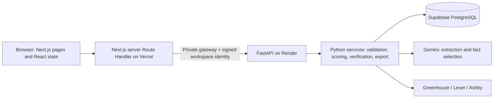

# HireMe AI — frontend migration and deployment guide

Current review date: **October 3, 2026**. The new application lives in `frontend/`. It preserves the existing FastAPI/Render, Supabase PostgreSQL and Gemini implementation. The public Next.js site is https://hireme-ai-tau.vercel.app. The existing Streamlit app and static homepage remain available while physical Safari checks and the documented upload-limit cutover decision are outstanding. See [the deployed-site guide](VERCEL_RELEASE.md).

## 1. Architecture and workflow



Old interface: Browser → Streamlit on Render → FastAPI. New interface: Browser → Next.js pages and same-origin BFF → FastAPI. Supabase, Gemini and ATS are **separate backend dependencies**, not a database-to-Gemini chain.

1. Upload a text-based PDF/DOCX and consent to Gemini processing.
2. Python checks the file and extracts text. Gemini returns structured profile facts.
3. Review each fact and inspect its original source. Review is not proof of identity or truth.
4. Import a JD or discover one supported company ATS board.
5. Explicitly analyze the job. Python validates Gemini requirements and caches them.
6. Python calculates the Career Fit Score and requirement/evidence mapping.
7. Consent to tailoring. Gemini selects reviewed fact IDs; Python builds and verifies wording.
8. Review the extract, export PDF/DOCX, and track an application. Apply yourself on the official posting.

## 2. Repository layout and changed files

```text
frontend/
  app/                         App Router pages, global CSS, loading/error fallbacks
    api/[...path]/route.ts      One finite, validated BFF dispatcher
    profile/ jobs/[id]/ match/ resume/ applications/ insights/ architecture/ privacy/
  components/
    common/ui.tsx              Buttons, messages, cards, states and safe links
    layout/                    Shell, mobile navigation, workspace and wake-up state
    profile/fact-ledger.tsx     Source evidence and review toggles
    jobs/                      Job cards, picker and requirement presentation
    matching/score-breakdown.tsx
  hooks/                       Read loading and duplicate-submit protection
  lib/
    api/                       Browser fetch, server fetch, allowlist, BFF
    workspace/session.ts       HMAC cookie issuance/verification
    schemas/                   Zod request validation
    errors/                    Safe, consistent error translation
    utils/                     Labels, links and score display
  contracts/openapi.json       Actual FastAPI schema snapshot
  types/backend.ts             Generated TypeScript API types
  types/index.ts               Presentation aliases for serialized responses
  tests/                       Unit, component, BFF and browser tests
  scripts/live-acceptance.mjs  Explicit synthetic acceptance against a real backend
  .env.example                Names and local placeholders only
  next.config.ts              Headers and framework configuration
  vercel.json                 Next.js, npm ci, Singapore functions, Fluid Compute
  package.json, package-lock.json
docs/MIGRATION_MATRIX.md       Feature-to-endpoint parity and limitations
docs/NEXTJS_MIGRATION.md        This operating guide
docs/FRONTEND_INTERVIEW_GUIDE.md Component explanations and interview answers
```

The release also updates `.gitignore`, `.dockerignore`, `.github/workflows/ci.yml`, `pyproject.toml` (exclude frontend dependency/build folders from Python lint), and the existing README/architecture/deployment/security/scaling notes. No Python route, scorer, provider, database schema, or migration is replaced. The exact release file list is recorded in `docs/FRONTEND_CHANGED_FILES.txt`.

## 3. Frontend local setup — this Windows workspace

The ignored `frontend/.env.local` was created for integration against the existing hosted API. It contains the server-side gateway value and a new random local signing secret, not a Gemini key or database password. Do not overwrite it.

```powershell
cd C:\Users\USER\OneDrive\Desktop\hireme-ai
$env:PATH = (Resolve-Path '.tools\node-runtime\node-v22.16.0-win-x64').Path + ';' + $env:PATH
cd frontend
npm ci
npm run dev
```

Open **http://127.0.0.1:3000**. Keep the terminal open. Stop with Ctrl+C. If port 3000 already has the review server, open it or stop that server first; do not run two processes on the same port.

On a new computer install Node 22.16 or newer within Node 22, clone the repo, run `npm ci` inside `frontend`, and create `.env.local` from `.env.example` only if it is absent. Generate a signing key locally:

```powershell
node -e "console.log(require('node:crypto').randomBytes(32).toString('hex'))"
```

Paste that value in your local file; never paste it into chat or GitHub. For a production-like local build, use `npm run build` then `npm run start` instead of `npm run dev`.

## 4. Backend local setup

Keep your existing root `.env`, Gemini key and selected accessible model. For a fully local API, set the frontend backend URL to `http://127.0.0.1:8000`. Set `SERVER_ONLY_SITE_ORIGIN=http://127.0.0.1:3000`. A development API normally does not require a gateway key; a production API always does.

In terminal 1, at the repository root:

```powershell
docker compose up -d postgres
.\.venv\Scripts\python.exe -m alembic upgrade head
.\.venv\Scripts\python.exe -m alembic check
.\.venv\Scripts\python.exe -m uvicorn apps.api.main:app --host 127.0.0.1 --port 8000
```

Root `.env` for live local use: `APP_ENV=development`, `APP_MODE=live`, your existing `DATABASE_URL`, `GEMINI_API_KEY`, `LLM_MODEL`, and `ENABLE_LIVE_JOB_DISCOVERY=true`. Restart the API when changing these values. In terminal 2 run the frontend commands above. Do not change the production Supabase password merely to test locally.

Fresh backend dependency setup: install Python 3.12 and uv, then run `uv sync --locked --extra dev` from the root. See [the existing live guide](LOCAL_LIVE_GUIDE.md) for Gemini account/model troubleshooting.

## 5. Environment boundary

| Variable | Where | Purpose |
|---|---|---|
| `NEXT_PUBLIC_SITE_URL` | Next.js, public | Canonical site URL for deployment/documentation; no credential |
| `SERVER_ONLY_BACKEND_URL` | Next.js server only | Root API URL; hosted HTTPS required |
| `SERVER_ONLY_BACKEND_GATEWAY_SECRET` | Next.js server only | Must match Render `API_GATEWAY_KEY` |
| `SERVER_ONLY_WORKSPACE_SECRET` | Next.js server only | Random signing key, at least 32 characters; use 32 random bytes as hex |
| `SERVER_ONLY_SITE_ORIGIN` | Next.js server only | Exact permitted browser origin, including scheme and local port |
| `API_GATEWAY_KEY` | Render API only | Existing private gateway credential |
| `GEMINI_API_KEY`, `LLM_MODEL` | Render API only | Gemini configuration |
| `DATABASE_URL`, `DATABASE_SSL`, `DATABASE_SSL_CA` | Render API only | Existing dedicated database login and verified TLS |

Vercel provides `VERCEL`, `VERCEL_URL`, and `VERCEL_PROJECT_PRODUCTION_URL`. The BFF recognizes its exact deployment URL for preview requests. Do not add wildcard origin rules. Use **different workspace signing secrets for Development, Preview and Production**. Keep one stable production secret across normal redeployments; rotating it invalidates old sessions.

`.env.deploy` is a local deployment credential store, not a frontend environment file. `VERCEL_TOKEN` belongs there only for authorized deployment automation. It must not be included in Vercel's application runtime variables.

## 6. Vercel deployment — preview before production

No paid upgrade is required for this personal non-commercial portfolio, subject to the providers' free-plan allowances. [Vercel Hobby scope](https://vercel.com/docs/plans/hobby) and [function limits](https://vercel.com/docs/functions/limitations) apply.

1. Sign into your Vercel account, choose your personal Hobby workspace, and import `JatinSharmab/hirem-ai` from GitHub.
2. Set the project root directory to **`frontend`** and framework to **Next.js**.
3. Set Node **22.x**, install `npm ci`, build `npm run build`. Leave output directory at the framework default. Do not choose a static export.
4. Keep the configuration from `frontend/vercel.json`: one `sin1` function region near the Render Singapore API, and Fluid Compute enabled. The Route Handler specifies a 120-second maximum; its upstream call timeout is 90 seconds. See [region configuration](https://vercel.com/docs/functions/configuring-functions/region).
5. Configure **Preview** environment values from the table. Use `https://hirem-ai-api.onrender.com` and the existing gateway credential. Generate a fresh Preview workspace secret. The Vercel deployment URL is automatically allowed; set a site origin only for a chosen stable preview alias.
6. Deploy a preview branch or an explicit CLI preview. Keep preview authentication protection enabled unless you deliberately need public access; browser acceptance requires an authorized session or Vercel's supported automation bypass. Never publish a bypass token.
7. Open the preview in a clean browser and complete the acceptance sequence below. Confirm correct cookies, no gateway key in browser assets, BFF success, no console errors, and phone/tablet layouts.
8. Add **Production** environment values, using a different signing secret and the exact final `https://<your-project>.vercel.app` origin. Set `NEXT_PUBLIC_SITE_URL` to that URL. A domain is only claimed as live after Vercel confirms the deployment.
9. Deploy/promote the tested release to production. Repeat hosted acceptance; local success does not prove hosted routing or environment configuration.
10. Update public README/portfolio links only after success. A later custom domain is added in Vercel Settings → Domains; follow its actual DNS instructions, then update the exact site origin and public URL and redeploy.
11. Keep the legacy Streamlit site available until the 4 MiB upload difference is accepted, physical-device checks are complete, and no required public workflow regresses. Suspending the old service is a separate final cutover action; do not delete its code or data during migration.

The Vercel project is now created in the existing Personal Hobby workspace and linked to GitHub, using the settings above. Credentials were installed privately. The canonical production URL is **https://hireme-ai-tau.vercel.app**. Render remains the Python backend. See [VERCEL_RELEASE.md](VERCEL_RELEASE.md) for this release and later deployment steps.

## 7. Render and CORS

Keep the existing API service and free plan. Preserve `APP_ENV=production`, live mode, Gemini key/model, `API_GATEWAY_KEY`, verified database TLS, migrations, quotas and ownership controls. `/health` is cheap; `/ready` checks database/migration readiness. Neither invokes Gemini.

The browser calls Next.js at its own origin. Next.js calls FastAPI server-to-server, so **the BFF does not depend on browser CORS permission**. After the actual Vercel production URL is known, set Render `ALLOWED_ORIGINS` and `FRONTEND_URL` to that exact URL as configuration hygiene and redeploy the API if changing its environment. Do not use `*`, broad `*.vercel.app`, or treat CORS as authentication. Keep the gateway check regardless of CORS.

Do not put `.env.deploy`, `.env.local`, `node_modules`, or `.next` in the backend image. The updated `.dockerignore` excludes the entire separate frontend directory.

## 8. Supabase

Use the already authorized `hireme-ai` project and dedicated application login. No database migration is needed for this UI change. Existing migration `0002`, owner filters, expiry and database quota accounting remain required. Keep TLS certificate verification and the existing pooler settings. Do not put Supabase service-role credentials in browser code or add direct browser database access.

## 9. Testing commands

Frontend, inside `frontend`:

```powershell
npm ci
npm run lint
npm run typecheck
npm test
npm run build
npx playwright install chromium
npm run test:e2e
```

This workspace can use installed Edge instead of downloading Chromium:

```powershell
$env:PLAYWRIGHT_EXECUTABLE_PATH = 'C:\Program Files (x86)\Microsoft\Edge\Application\msedge.exe'
npm run test:e2e
```

Backend, from the root:

```powershell
.\.venv\Scripts\python.exe -m pytest -p no:cacheprovider
.\.venv\Scripts\python.exe -m ruff check .
.\.venv\Scripts\python.exe -m ruff format --check .
.\.venv\Scripts\python.exe -m mypy src/hireme_ai
.\.venv\Scripts\python.exe evaluation/run_evaluation.py
.tools\node-runtime\node-v22.16.0-win-x64\node.exe --test tests/web/*.test.mjs
.\.venv\Scripts\python.exe -m alembic check
```

Run storage scripts only against the intended configured database: `scripts/check_live_storage.py` and `scripts/check_public_storage.py`. CI runs them against its isolated PostgreSQL service.

For a real release check, first start the built frontend, then in another frontend terminal:

```powershell
$env:ALLOW_LIVE_AI = '1'
$env:ACCEPTANCE_URL = 'http://127.0.0.1:3000' # or the authorized preview/production URL
npm run acceptance:live
```

For a protected preview, supply `VERCEL_AUTOMATION_BYPASS_SECRET` privately to the test process. The script attaches it only to that exact preview origin. Do not use a `NEXT_PUBLIC_` variable. Set `ACCEPTANCE_ARTIFACT_DIR` to separate reports from different targets.

This deliberately uses three real Gemini calls and three ATS calls. It uses synthetic resume data, verifies downloads and isolation, and deletes its test records. It does not run automatically in CI. Results/screenshots are in ignored `frontend/artifacts/live/`. Error injection for database failures, quota, provider timeouts and hostile cookies uses mocks; do not take the public database offline to manufacture a test.

## 10. Acceptance and release status

See [FRONTEND_VALIDATION.md](FRONTEND_VALIDATION.md) for exact results, failures corrected and remaining hosted/device checks. GitHub CI independently runs backend quality/storage checks and the frontend build, tests and browser suite. The hosted release and its separate public-domain checks are recorded in [VERCEL_RELEASE.md](VERCEL_RELEASE.md).

## 11. Security decisions

- Server-only modules guard gateway access. No Gemini/DB SDK or credential is shipped to client code.
- A signed UUIDv4 workspace cookie is HTTP-only, SameSite=Lax, and uses `__Host-` + Secure on Vercel. Tampering/expiry produces a safe error and removes the invalid cookie.
- Mutation requests require an exact allowed Origin and reject cross-site Fetch Metadata. Visitor headers cannot override the server gateway/workspace headers.
- The proxy only permits known methods/routes. User-supplied destination URLs and arbitrary query strings are rejected. Upstream redirects are not followed.
- Streamed request bytes are bounded, not just Content-Length. Upload validation stays in Python; Zod adds a request-shape boundary.
- API results use `no-store, private`; no sensitive localStorage, service-worker cache or analytics is added.
- Arbitrary backend exception text is not forwarded. Only a small known-safe set of parser messages survives error normalization.
- Deleting data keeps the session identity and usage counters. Late responses cannot restore cleared profile/match/version state in the provider.
- Security headers block framing and plugin objects. The CSP is intentionally partial; it is **not** a strict nonce-based script policy.
- Anonymous sessions are not strong anti-abuse identity. A new cookie can bypass visitor limits; global backend budgets remain the final ceiling. No account recovery is promised.

## 12. Performance and limitations

- Overview, architecture and the page shells are pre-rendered. No server-rendering step waits for FastAPI.
- Browser startup performs session initialization and bounded health/settings reads only. It never automatically calls Gemini.
- Wake checks stop after eight attempts or two minutes. An explicit Retry starts another bounded cycle. No cron/uptime pinger is configured.
- Free Render cold starts still affect AI/data actions. Fast frontend delivery does not make Gemini or the database instantaneous.
- BFF upstream timeout is 90 seconds; Vercel maximum duration is 120 seconds. A timed-out mutation may still complete in Python. Do not blindly repeat it; refresh records first.
- Vercel's 4.5 MB function cap requires a 4 MiB frontend upload limit; backend cap remains 5 MiB. Large job lists/exports also need future pagination or staged delivery.
- Profile, fact review, match, bookmarks and resume versions are memory-only. Reloading loses these, while database jobs/applications remain until expiry.
- Physical Safari testing and hosted performance measurements are distinct from local Edge viewport checks. No unmeasured speedup or accuracy number is claimed.
- TypeScript 5.9 is pinned because the current OpenAPI type generator declares a TypeScript 5 peer dependency. ESLint 9.39.5 is retained because the current Next.js React plugin fails with ESLint 10; update the plugin/toolchain together when compatible. No forced incompatible install is used.

## 13. Future scaling

Start with measured bottlenecks: add server pagination, durable tasks/idempotency keys, account-based ownership and persistence, distributed limits, provider circuit breakers, structured observability, backup/restore drills and evaluated semantic retrieval. Paid always-on compute is an optional future operating decision, not part of this free deployment. See [PRODUCTION_SCALING.md](PRODUCTION_SCALING.md).

For resume bullets, component-by-component WHAT/WHY/HOW/WHERE explanations, alternatives, risks, failure modes, tests and spoken interview answers, use [FRONTEND_INTERVIEW_GUIDE.md](FRONTEND_INTERVIEW_GUIDE.md).
